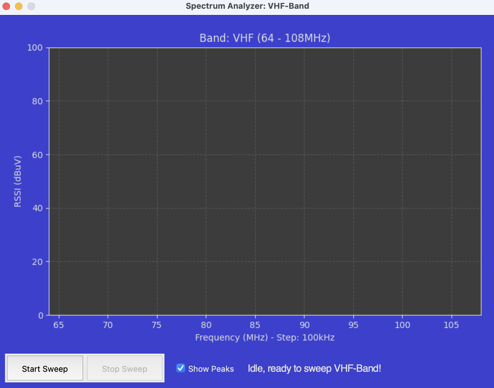

# Mini-Radio Control GUI

This updated version is fit for smaller resolution sizes and easier on the eyes with the blue color.  It also contains some new features to set memory locations.

This Python application provides a graphical user interface (GUI) to control an ESP32-based SI4732 radio receiver via a serial connection. It allows users to easily manage various radio functions, view stored memories, and analyze the radio spectrum without needing to send raw serial commands manually.


## Features:

*   **Intuitive GUI:** A user-friendly interface built with `guizero` for controlling radio operations.
*   **Serial Port Management:**
    *   Automatically detects available serial ports.
    *   Attempts to pre-select a likely port based on common USB-to-Serial chip names (e.g., CH340, CP210, FTDI) or generic terms like "USB SERIAL".
    *   Allows users to select the correct port and **baud rate** for their radio from dropdown menus.
    *   Provides a "Connect"/"Disconnect" toggle button to establish, terminate, and re-establish the serial connection.
*   **Radio Control Functions:**
    *   Encoder Rotate (Frequency Up/Down, Menu Scroll)
    *   Encoder Button Press
    *   Volume Up/Down
    *   Next/Previous Band
    *   Next/Previous Mode (FM/LSB/USB/AM)
    *   Next/Previous Step Size
    *   Next/Previous Bandwidth
    *   AGC/Attenuator Next/Previous
    *   Backlight Brighter/Dimmer
    *   Calibration Up/Down
    *   Sleep Timer On/Off
*   **Real-time Status Display:**
    *   Firmware Version
    *   Current Frequency (displayed in MHz for FM, kHz for AM/SSB, with BFO for SSB)
    *   Current Band and Mode
    *   Volume Level (value and percentage)
    *   Battery Level (voltage and percentage)
    *   Step Size, Bandwidth, AGC Status
    *   Signal Strength (RSSI and SNR)
*   **Configurable Cyclic Status Reading:**
    *   A checkbox allows users to enable or disable the continuous polling of status information from the radio.
*   **Memory Viewer:**
    *   Opens in a separate window.
    *   "Load Memories from Radio" button fetches and displays stored memory channels (01-99) (PLEASE UPDATE to firmware v2.30!).
    *   Users can select a memory slot from a dropdown to view its stored Frequency, Band, and Mode.
    *   Intelligently parses memory data, accommodating different formats (3-part or 4-part lines) that the radio might send.
    *   The "Set" button can be used to set a memory channel once the memory is loaded for the first time.  Enter "0" for the frequency to clear a channel.
      
      
    
*   **Spectrum Analyzer:**
    *   Opens in a separate, non-resizable window to display a real-time spectrum plot (RSSI vs. Frequency) for the band currently active on the radio.
    *   **Intelligent Peak Detection:**
        *   "Show Peaks" checkbox to toggle the display of detected signal peaks.
        *   Employs an advanced algorithm that calculates a *local average RSSI* within a configurable window around each data point.
        *   The peak detection threshold is dynamically adjusted based on this local average plus a defined offset. This adaptive approach allows for reliable identification of significant signals even with varying noise floors across the band, minimizing clutter from minor fluctuations.
    *   **Dynamic Visualization:**
        *   The Y-axis (RSSI) dynamically scales to fit the received signal strengths, with a configurable padding for better readability.
        *   The area under the spectrum curve is filled for enhanced visual clarity.
    *   **Controls:** "Start Sweep" and "Stop Sweep" buttons to manage the spectrum scanning process.
    *   **Usage Note:** To analyze the spectrum of a different band, the Spectrum Analyzer window must be closed. Then, select the new band using the main radio controls in the application, and finally, reopen the Spectrum Analyzer window.
 
       
    
*   **Dark Theme:** A visually comfortable dark theme for all windows.
*   **User Experience Enhancements:**
    *   Connect button provides feedback on connection status and errors.
    *   Warnings if trying to operate controls or open feature windows while disconnected.
*   **Cross-Platform (Potentially):** Built with Python, `pyserial`, `guizero`, and `matplotlib`, making it potentially cross-platform (developed and tested on Linux).

## How it Works:

The application sends single-character commands to the SI4732 radio (as documented for many ESP32-SI4732 projects) over the selected serial port.
When "Enable Cyclic Reading" is active, it periodically reads a comma-separated status string from the radio, parses it, and updates the relevant display fields in the GUI. This is toggled via a 't' command.
The Memory Viewer sends a '$' command to the radio to request the memory dump.
The Spectrum Analyzer repeatedly sends an "Encoder Rotate Right" command ('R') to step through frequencies, receiving and plotting the RSSI for each step.

## Technologies Used:

*   **Python 3**
*   **pyserial:** For serial communication.
*   **guizero:** For creating the graphical user interface.
*   **matplotlib:** For plotting the spectrum in the Spectrum Analyzer.

## Getting Started:

### Running from Source (Python 3 required)

1.  **Prerequisites:**
    *   Ensure you have Python 3 installed on your system.
    *   An ESP32-SI4732 based radio receiver flashed with firmware that supports serial control, the described log output format, memory dump via '$', and frequency stepping via 'R'.

2.  **Installation of Dependencies:**
    Open your terminal or command prompt and install uv (https://docs.astral.sh/uv/getting-started/installation/#cargo):
    ```bash
    brew install uv
    ```
    If you have installed python via brew, you may also need to install the following to avoid the error "**tkinter did not import successfully**" when running the application.
    ```
    brew install python-tk
    ```

4.  **Running the Application:**
    *   Connect your ESP32-SI4732 radio to your computer via USB.
    *   Download or clone this repository.
    *   Navigate to the directory containing `ATSMiniController`.
    *   Ensure the file is executable (one time action needed):
        ```bash
        chmod +x ATSMiniController
        ```
    *   Run the script (this will setup the python environment and install all packages, etc.):
        ```
        ./ATSMiniController
        ```
    *   The application will attempt to auto-select a serial port and will use a default baud rate (115200). Adjust these via the dropdowns if necessary.
    *   Click the "Connect" button. It will change to "Disconnect" upon successful connection.
    *   Check the "Enable Cyclic Reading" checkbox to see live status updates from the radio.
    *   Use the buttons and feature windows to control and explore your radio.
