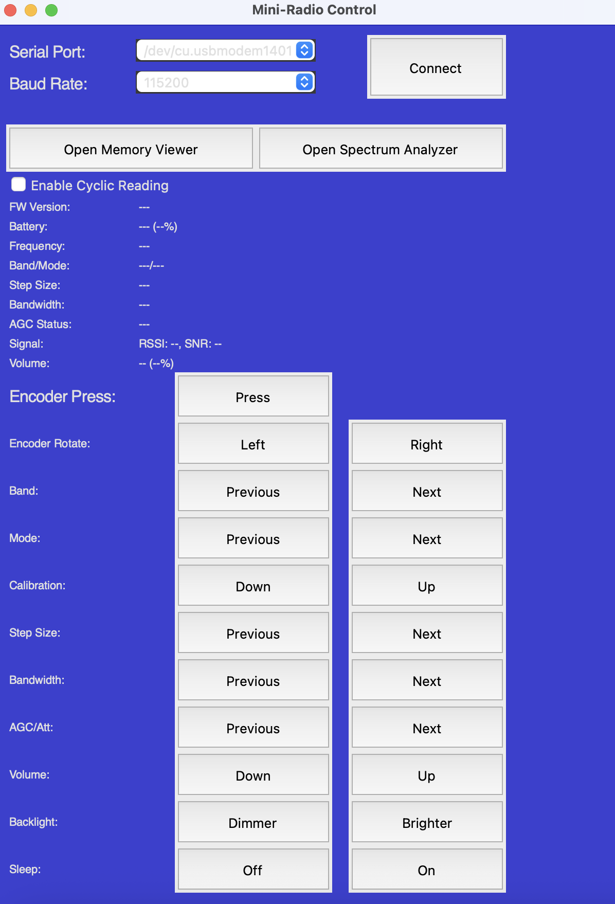

# Mini-Radio Control GUI

This Python application provides a graphical user interface (GUI) to control an ESP32-based SI4732 radio receiver via a serial connection. It allows users to easily manage various radio functions without needing to send raw serial commands manually.

 

## Features:

*   **Intuitive GUI:** A user-friendly interface built with `guizero` for controlling radio operations.
*   **Serial Port Management:**
    *   Automatically detects available serial ports.
    *   Attempts to pre-select a likely port based on common USB-to-Serial chip names (e.g., CH340, CP210, FTDI) or generic terms like "USB SERIAL".
    *   Allows users to select the correct port and **baud rate** for their radio from dropdown menus.
    *   Provides a "Connect"/"Disconnect" toggle button to establish, terminate, and re-establish the serial connection.
*   **Radio Control Functions:**
    *   Encoder Rotate (Frequency Up/Down, Menu Scroll)
    *   Encoder Button Press (represented by a clickable icon)
    *   Volume Up/Down
    *   Next/Previous Band
    *   Next/Previous Mode (FM/LSB/USB/AM)
    *   Next/Previous Step Size
    *   Next/Previous Bandwidth
    *   AGC/Attenuator Next/Previous
    *   Backlight Brighter/Dimmer
    *   Calibration Up/Down
    *   Sleep Timer On/Off
*   **Real-time Status Display:**
    *   Firmware Version (e.g., "2.01" instead of "v2.01")
    *   Current Frequency (displayed in MHz for FM, kHz for AM/SSB, with BFO for SSB; units directly appended, e.g., "145.500MHz")
    *   Current Band and Mode (e.g., "SW/USB")
    *   Volume Level (e.g., "30 (48%)")
    *   Battery Level (e.g., "4.05V (80%)")
    *   Step Size, Bandwidth, AGC Status
    *   Signal Strength (RSSI and SNR)
*   **Configurable Cyclic Status Reading:**
    *   A checkbox (with a flat, borderless design) allows users to enable or disable the continuous polling of status information from the radio.
    *   Status display fields are reset to placeholders when disconnected.
*   **Dark Theme:** A visually comfortable dark theme for the interface.
*   **User Experience Enhancements:**
    *   Connect button provides feedback on connection status and errors, including multi-line error messages.
    *   Warnings if trying to operate controls or checkbox while disconnected.
*   **Cross-Platform (Potentially):** Built with Python, `pyserial`, `guizero`, and `Pillow`, making it potentially cross-platform (developed and tested on Linux).

## How it Works:

The application sends single-character commands to the SI4732 radio (as documented for many ESP32-SI4732 projects) over the selected serial port. When "Enable Cyclic Reading" is active and checked, it periodically reads a comma-separated status string from the radio, parses it, and updates the relevant display fields in the GUI. The cyclic reading is controlled via a checkbox, which sends a toggle command (`t`) to the radio to start or stop the log stream.

## Technologies Used:

*   **Python 3**
*   **pyserial:** For serial communication.
*   **guizero:** For creating the graphical user interface.
*   **Pillow (PIL):** For image manipulation (e.g., scaling the icon for the encoder button).

## Getting Started:

1.  **Prerequisites:**
    *   Ensure you have Python 3 installed on your system.
    *   An ESP32-SI4732 based radio receiver flashed with firmware that supports serial control and the described log output format.
    *   An icon file (e.g., `buttonpress.png`) in the same directory as the script if you want to use the icon for the Encoder Button. A fallback text button will be shown if the icon is not found.

2.  **Installation of Dependencies:**
    Open your terminal or command prompt and install the necessary Python libraries:
    ```bash
    pip install pyserial guizero Pillow
    ```

3.  **Running the Application:**
    *   Connect your ESP32-SI4732 radio to your computer via USB.
    *   Download or clone this repository.
    *   Navigate to the directory containing `MiniRadio.py` (or your script's name).
    *   Run the script:
        ```bash
        python MiniRadio.py
        ```
    *   The application will attempt to auto-select a serial port and will use a default baud rate (115200). Adjust these via the dropdowns if necessary.
    *   Click the "Connect" button. It will change to "Disconnect" upon successful connection.
    *   Check the "Enable Cyclic Reading" checkbox to see live status updates from the radio.
    *   Use the buttons and the encoder icon to control your radio.

## Configuration:

*   **Serial Port & Baud Rate:** The application attempts to auto-select a serial port. Both port and baud rate can be selected from their respective dropdown menus before connecting.
*   **Encoder Button Icon:** The script looks for an icon file (default: `buttonpress.png`) in its directory for the Encoder Button. If not found, a text button is displayed as a fallback.

## Known Issues / Limitations:

*   The reliability of cyclic status updates can sometimes be affected by the quality of the serial connection or the radio's responsiveness.
*   The precise visual centering of the Encoder Button icon across two grid columns can be challenging with `guizero` and might appear slightly different depending on the environment. The current implementation uses a stretched icon as a workaround.

## Future Enhancements (Ideas):

*   More robust error handling and feedback for serial communication issues during operation.
*   Ability to save and load preferred settings (e.g., last used port and baud rate).
*   Visual feedback for ongoing commands or when the radio is busy.
*   A more sophisticated method for the Encoder Button layout if `guizero`'s capabilities allow.
*   Option to customize the Encoder Button icon path.

## Contributing:

Contributions, bug reports, and feature requests are welcome! Please feel free to open an issue or submit a pull request.

## License:

This project is licensed under the MIT License - see the LICENSE.md file for details.
